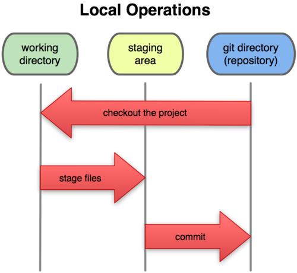

## [git - 简易指南](http://www.bootcss.com/p/git-guide/)
## [猴子都能懂的GIT入门](http://backlogtool.com/git-guide/cn/)
## [廖雪峰的Git教程](http://www.liaoxuefeng.com/wiki/0013739516305929606dd18361248578c67b8067c8c017b000)
## ...


# git要点

>Git只关心文件数据的整体是否发生变化,而大多数其他系统则只关心文件内容的具体差异，这类系统(CVS,Subversion,Perforce,Bazaar 等等)每次记录有哪些文件作了更新,以及都更新了哪些行的什么内容

### 近乎所有操作都可本地执行
在 Git 中的绝大多数操作都只需要访问本地文件和资源,不用连网。但如果用 CVCS 的话,差不多所有操
作都需要连接网络。因为 Git 在本地磁盘上就保存着所有有关当前项目的历史更新,所以处理起来速度飞
快。

### 时刻保持数据完整性

在保存到 Git 之前,所有数据都要进行内容的校验和(checksum)计算,并将此结果作为数据的唯一标识
和索引。换句话说,不可能在你修改了文件或目录之后,Git 一无所知。这项特性作为 Git 的设计哲学,建
在整体架构的最底层。所以如果文件在传输时变得不完整,或者磁盘损坏导致文件数据缺失,Git 都能立即察
觉。

Git 的工作完全依赖于这类指纹字串,所以你会经常看到这样的哈希值。实际上,所有保存在 Git 数据库
中的东西都是用此哈希值来作索引的,而不是靠文件名。

### 多数操作仅添加数据

常用的 Git 操作大多仅仅是把数据添加到数据库。因为任何一种不可逆的操作,比如删除数据,要回退或
重现都会非常困难。

### 三种状态

对于任何一个文件,在 Git 内都只有三种状态:已提交(committed),已修改(modified)和已暂存(staged)已提交表示该文件已经被安全地保存在本地数据库中了;已修改表示修改了某个文件,但还没有提交保存;已暂存表示把已修改的文件放在下次提交时要保存的清单中。

每个项目都有一个 git 目录,它是 Git 用来保存元数据和对象数据库的地方。该目录非常重要,每次克隆
镜像仓库的时候,实际拷贝的就是这个目录里面的数据。
从项目中取出某个版本的所有文件和目录,用以开始后续工作的叫做工作目录。这些文件实际上都是从 git
目录中的压缩对象数据库中提取出来的,接下来就可以在工作目录中对这些文件进行编辑。
所谓的暂存区域只不过是个简单的文件,一般都放在 git 目录中。有时候人们会把这个文件叫做索引文
件,不过标准说法还是叫暂存区域。


1. 在工作目录中修改某些文件。
2. 对这些修改了的文件作快照,并保存到暂存区域。
3. 提交更新,将保存在暂存区域的文件快照转储到 git 目录中。

# 基础命令

```
git clone ...
git status
git add ...(这是个多功能命令,根据目标文件的状态不同,此命令的效果也不同:可以用它开始跟踪新文件,或者把已跟踪的文件放到暂存区,还能用于合并时把有冲突的文件标记为已解决状态等)
git diff
git diff --cached
git diff --staged
```
